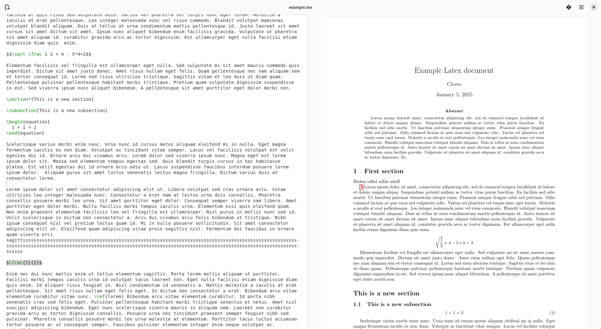

# Texwriter

An experimental LaTeX editor written in python using Gtk. 
Currently everything is super buggy, but it is slowly getting to a usable state.

Features:
 - Basic command completion
 - Basic syntax highlighting
 - Log viewer: clickable log entries bringing you to the correct place in the source

## Notes

If the project interests you, please contact me.

Planned features:
 - Inline equation rendering
 - WYSIWYG sections/chapters, etc
 - Pinch to zoom
 - Good inclusion mechanisms: drag-and-drop of pictures
 - TikZ drawing?
 - Bibtex support???
